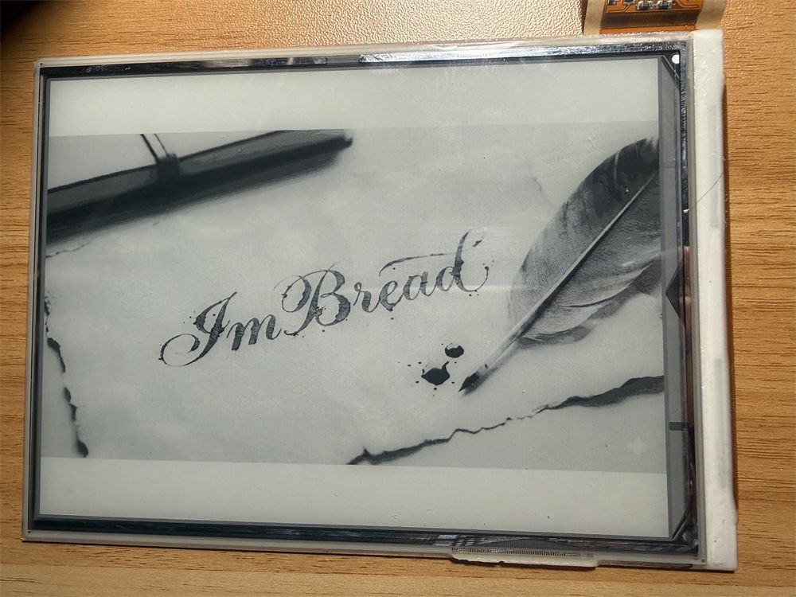
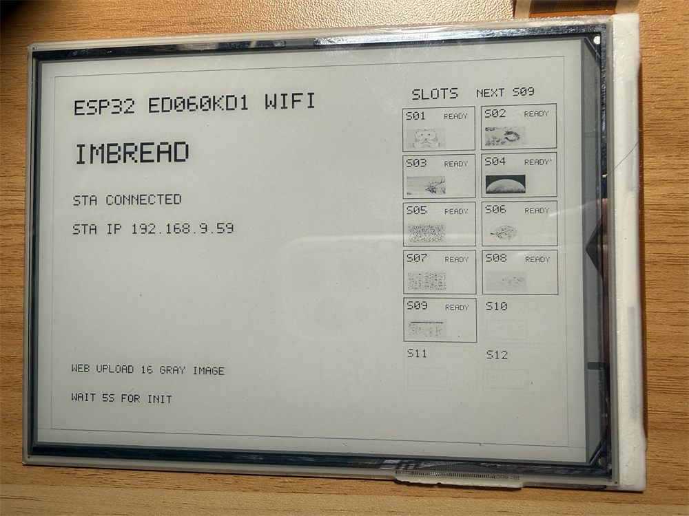
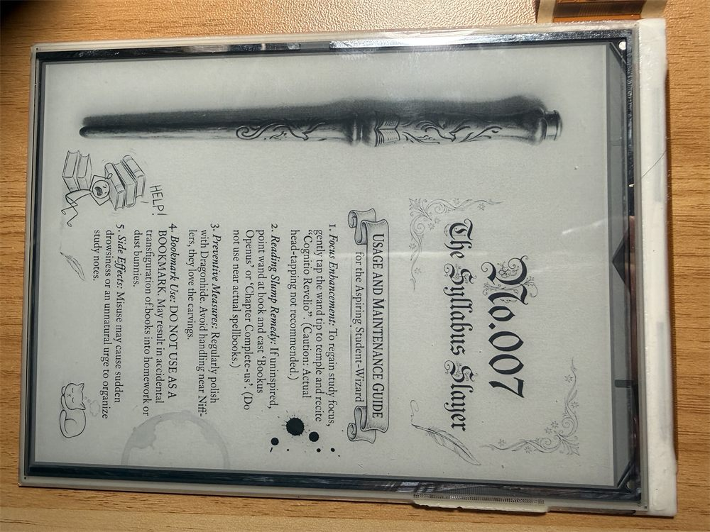
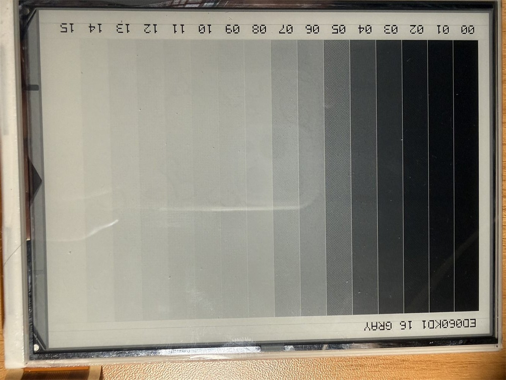
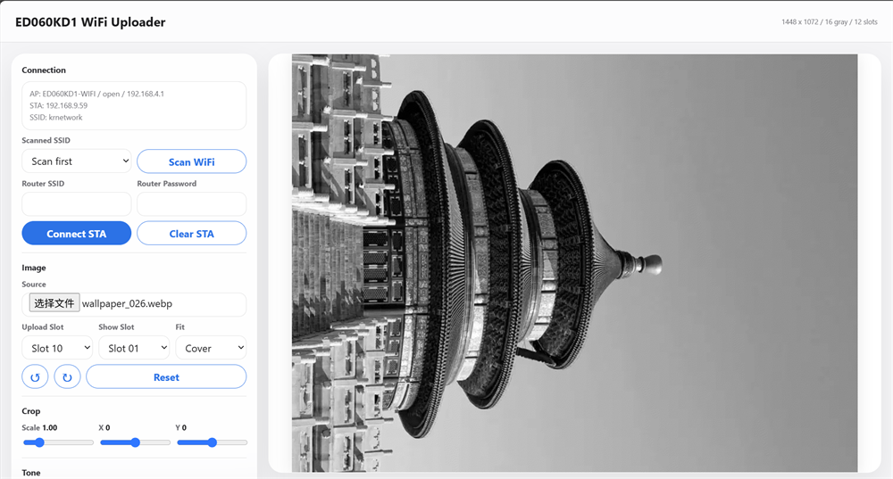
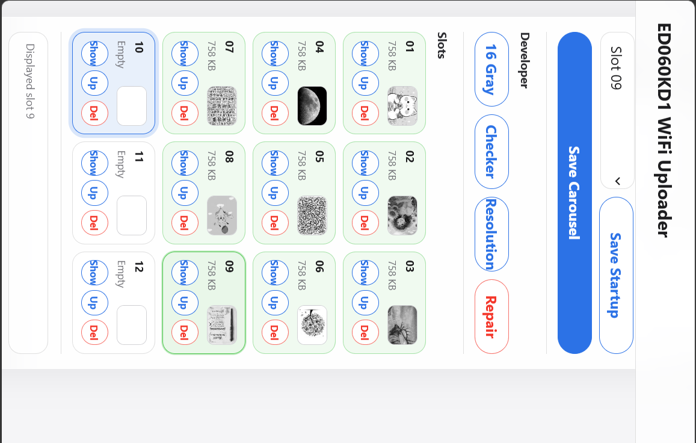

# ED060KD1 WiFi 图传 / Ink MONO Image Uploader

## 中文说明

### 项目简介

`Ink_MONO_Image_UPloader` 是为 ED060KD1 6 英寸灰阶墨水屏调通的 ESP32-S3 WiFi 图传固件。项目基于 PlatformIO / Arduino 框架，使用 epdiy V7 并口墨水屏驱动，并保留了当前已经实测稳定的 ED060KD1 GPIO 定义和 16 灰阶 LUT 校准参数。

固件启动后会创建开放 WiFi 热点，也可以配置 STA 模式接入路由器。用户通过浏览器上传图片，网页端完成裁剪、旋转、缩放、亮度、对比度和灰阶转换，ESP32 端将处理后的 4bpp 灰阶帧保存到 LittleFS slot，并刷新到屏幕。

### 已实现功能

- ED060KD1 `1448 x 1072` 分辨率显示。
- ESP32-S3-N16R8 / 16 MB Flash / PSRAM 支持。
- epdiy V7 并口墨水屏驱动。
- GPIO46 屏幕电源控制。
- 已校准的 ED060KD1 16 灰阶映射。
- 开放 AP：`ED060KD1-WIFI`，无密码。
- STA 模式：支持扫描 SSID、输入密码并连接路由器。
- Web 图片上传：裁剪、旋转、缩放、亮度、对比度和灰阶取模。
- 12 个图片 slot，每个 slot 保存一张完整 4bpp 灰阶图。
- slot 缩略图、显示、删除、覆盖上传和启动默认 slot。
- 图片轮播：按顺序跳过空 slot。
- 开机 logo、配置页、slot 状态预览。
- 开发者模式：16 灰阶图、棋盘格、分辨率测试、黑白循环修复。
- 生成好的 full flash 包保存在 `dist/`。

### 效果图

#### 开机画面 / Startup screen

设备上电后显示 logo 页面，用于确认屏幕初始化和基础刷新流程正常。



#### 配置页面 / Device configuration screen

开机后的配置页会显示 AP / STA 状态、访问地址、slot 状态和即将显示的图片槽位。



#### 图片显示效果 / Image display result

上传图片经过网页端裁剪、旋转、缩放和灰阶取模后，在 ED060KD1 上显示的实拍效果。



#### 16 灰阶校准 / 16-level grayscale calibration

开发者模式中的 16 灰阶测试图，用于观察 ED060KD1 当前 LUT 的灰阶过渡是否均匀。



#### Web 上传页面 / Web uploader

浏览器端主界面，支持图片选择、预览、裁剪、旋转、缩放、亮度和对比度调整。



#### Slot 管理页面 / Slot management

slot 控制区域提供上传目标选择、缩略图、显示、删除、轮播和启动 slot 配置。



### 硬件需求

| 项目 | 参数 |
| --- | --- |
| MCU | ESP32-S3-N16R8 |
| 屏幕 | ED060KD1 |
| 分辨率 | 1448 x 1072 |
| 驱动 | epdiy V7 |
| Flash | 16 MB |
| 文件系统 | LittleFS |
| 屏幕电源 GPIO | GPIO46 |

### Flash 分区

项目使用自定义 `partitions.csv`：

| 分区 | 偏移 | 大小 | 用途 |
| --- | --- | --- | --- |
| `nvs` | `0x9000` | `0x5000` | WiFi / 轮播 / 启动 slot 配置 |
| `app0` | `0x10000` | `0x300000` | 固件 |
| `spiffs` | `0x310000` | `0xCF0000` | LittleFS 图片 slot 存储 |

每张图片使用 `1448 x 1072 x 4bpp` 打包格式，单 slot 大小约 758 KB。当前固件固定使用 12 个 slot。

### 编译和烧录

安装 PlatformIO 后，在项目根目录执行：

```powershell
platformio run
platformio run -t upload
```

当前 `platformio.ini` 默认端口为 `COM21`，如需修改请调整：

```ini
upload_port = COM21
monitor_port = COM21
```

### 首次使用

1. 烧录固件并启动设备。
2. 手机或电脑连接开放热点 `ED060KD1-WIFI`。
3. 打开浏览器访问 `http://192.168.4.1`。
4. 在 Web 页面选择图片，完成裁剪、旋转、缩放和灰阶调整。
5. 选择 upload slot，点击上传。
6. 上传完成后屏幕会刷新显示该 slot。

### STA 模式

Web 页面提供 WiFi 扫描功能。扫描后选择路由器 SSID，输入密码并保存。连接成功后，屏幕状态页和 Web 页面会显示 STA IP 地址。AP 模式仍保持开启，方便设备找回。

### 图片格式

浏览器端会把图片转换为 `1448 x 1072` packed 4bpp grayscale frame：

- 每个像素 4 bit，灰阶范围 `0-15`。
- pixel 0 存在低 nibble。
- pixel 1 存在高 nibble。
- 固件显示前会通过 ED060KD1 校准表映射到实际驱动灰阶。

### 开发者模式

Web 页面的 Developer 区域提供：

- `16 Gray`：显示 16 灰阶块，用于检查灰阶分布。
- `Checker`：满屏棋盘格，用于观察断线、错位或数据线异常。
- `Resolution`：点对点分辨率测试图。
- `Repair`：黑白循环刷新 10 次，用于尝试清除残影。

### 目录结构

```text
.
|-- dist/                         # full flash package
|-- lib/epdiy2/                   # trimmed epdiy driver source
|-- readme/                       # README images
|-- src/
|   |-- ed060kd1_driver.cpp       # ED060KD1 display driver wrapper
|   |-- ed060kd1_driver.h
|   |-- logo_image.h              # startup logo bitmap
|   |-- main.cpp                  # WiFi, filesystem, slots, display logic
|   `-- web_page.h                # embedded web UI
|-- partitions.csv
|-- platformio.ini
`-- README.md
```

### 注意事项

- AP 默认无密码，适合调试和本地离线使用；部署到公共环境时请自行增加访问控制。
- 大尺寸墨水屏刷新较慢，开发者修复模式会耗时较长。
- slot 数据存储在 LittleFS 中，重新烧录 full 包或格式化文件系统会清空图片。
- 当前驱动参数针对本项目硬件验证，移植到其它 epdiy V7 板卡前请核对 GPIO 和供电控制。

---

## English

### Overview

`Ink_MONO_Image_UPloader` is a PlatformIO / Arduino firmware project for driving an ED060KD1 grayscale e-paper panel with an ESP32-S3-N16R8 board and an epdiy V7 parallel EPD interface.

The firmware exposes a browser-based image uploader. Images are cropped, rotated, scaled, brightness/contrast adjusted and converted to a calibrated 16-level grayscale frame in the browser, then uploaded to ESP32 LittleFS slots and displayed on the panel.

### Features

- ED060KD1 `1448 x 1072` display support.
- ESP32-S3-N16R8 with 16 MB flash and PSRAM.
- epdiy V7 display driver integration.
- GPIO46 panel power control.
- Calibrated ED060KD1 16-level grayscale mapping.
- Open AP mode: `ED060KD1-WIFI`, no password.
- STA mode with WiFi scan, router SSID selection and password input.
- Web image processing: crop, rotate, scale, brightness, contrast and grayscale conversion.
- 12 persistent image slots in LittleFS.
- Slot thumbnails, upload, show, delete and startup-slot selection.
- Carousel playback that skips empty slots.
- Startup logo, device configuration screen and slot preview page.
- Developer tools: 16-gray test, checkerboard, resolution test and repair refresh.
- Ready-to-flash full binary package under `dist/`.

### Hardware Requirements

| Item | Value |
| --- | --- |
| MCU | ESP32-S3-N16R8 |
| Panel | ED060KD1 |
| Resolution | 1448 x 1072 |
| Driver | epdiy V7 |
| Flash | 16 MB |
| Filesystem | LittleFS |
| Panel power GPIO | GPIO46 |

### Flash Layout

The project uses a custom `partitions.csv`:

| Partition | Offset | Size | Purpose |
| --- | --- | --- | --- |
| `nvs` | `0x9000` | `0x5000` | WiFi, carousel and startup-slot settings |
| `app0` | `0x10000` | `0x300000` | Firmware |
| `spiffs` | `0x310000` | `0xCF0000` | LittleFS image-slot storage |

Each image slot stores one `1448 x 1072` packed 4bpp grayscale frame, about 758 KB per slot. The firmware currently exposes 12 slots.

### Build And Flash

Install PlatformIO, then run from the project root:

```powershell
platformio run
platformio run -t upload
```

The default serial port is `COM21` in `platformio.ini`:

```ini
upload_port = COM21
monitor_port = COM21
```

Change it if your board appears on another port.

### Quick Start

1. Flash the firmware and boot the board.
2. Connect your phone or computer to the open AP `ED060KD1-WIFI`.
3. Open `http://192.168.4.1` in a browser.
4. Pick an image and adjust crop, rotation, scale, brightness and contrast.
5. Select an upload slot and upload.
6. The selected slot is stored and refreshed on the e-paper panel.

### STA Mode

The web UI can scan nearby WiFi networks. Select a router SSID, enter the password and save. After a successful connection, the STA IP address is shown on the display status page and in the web UI. AP mode remains enabled as a fallback access path.

### Upload Frame Format

The browser sends a `1448 x 1072` packed 4bpp grayscale frame:

- 4 bits per pixel, input level `0-15`.
- Pixel 0 is stored in the low nibble.
- Pixel 1 is stored in the high nibble.
- Firmware maps each input level through the calibrated ED060KD1 grayscale table before drawing to the epdiy framebuffer.

### Developer Tools

The Developer section in the web UI includes:

- `16 Gray`: draw 16 grayscale blocks for grayscale calibration checks.
- `Checker`: draw a full-screen checkerboard to inspect signal-line issues.
- `Resolution`: draw a pixel-aligned resolution test pattern.
- `Repair`: run 10 black/white refresh cycles to reduce ghosting.

### Notes

- The AP is intentionally open for lab use. Add access control before using it in an untrusted environment.
- Large e-paper refreshes are slow by nature; repair refresh takes longer than a normal image update.
- Slot images live in LittleFS. Flashing a full image package or formatting the filesystem can erase stored images.
- The included driver settings are validated for this hardware. Check GPIO and power-control wiring before porting to another epdiy V7 board.

